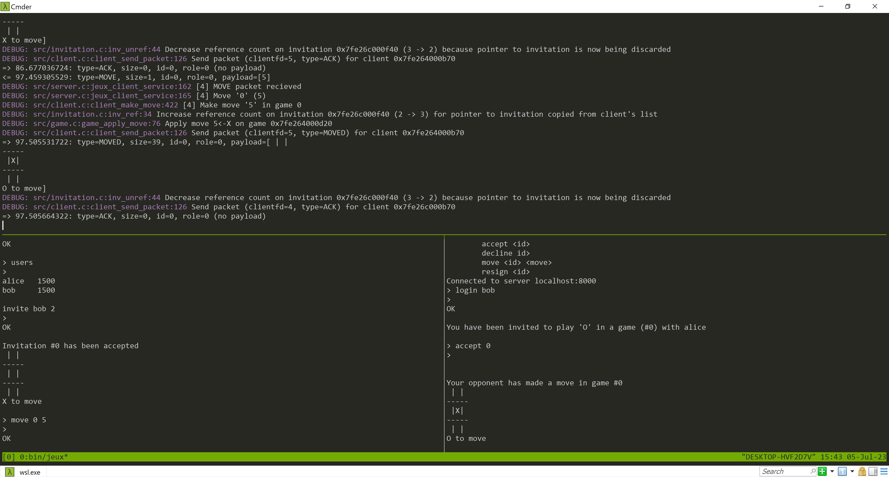

# Jeux

A general purpose, multi-threaded, game server for tic-tac-toe. This project uses Unix sockets to make connections and multi-threading to serve several clients at once. It implements the Jeux protocol to transfer data. 

